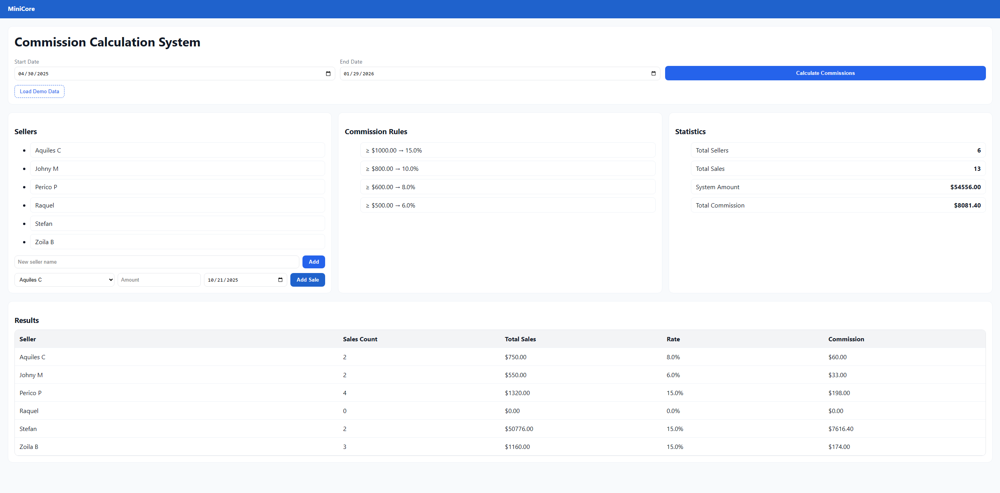

# Commission Calculation System

A full-stack web application built with **FastAPI (Python)** and **React (Vite + Sass)** that calculates commissions for salespeople based on configurable rules.
The system follows the **MVC architecture**, supports **data visualization**, and is fully deployable to the cloud (Render + Vercel).

<p align="center">
  
</p>

---

## Overview

This project simulates a small business scenario where sellers receive commissions according to their total sales amount within a specific date range.
It allows users to:

* Create new sellers
* Register sales with amount and date
* Generate commissions automatically based on defined rules
* View summary statistics and per-seller results in a responsive frontend

---

## Tech Stack

| Layer        | Technology                       | Description                                    |
| ------------ | -------------------------------- | ---------------------------------------------- |
| **Frontend** | React (Vite)                     | SPA using Sass (BEM), CSS Grid, and Flexbox    |
| **Backend**  | FastAPI                          | RESTful API implementing MVC pattern           |
| **Database** | SQLite                           | Local database for simplicity                  |
| **Styling**  | Sass                             | Variables, nesting, and component organization |
| **Deploy**   | Render (API) / Vercel (Frontend) | Cloud hosting for full integration             |

---

## Architecture (MVC)

```
backend/
├── app/
│   ├── models/          # Database models (Seller, Sale)
│   ├── schemas/         # Pydantic schemas (validation)
│   ├── controllers/     # Business logic and commission rules
│   ├── routes/          # FastAPI endpoints
│   ├── database.py      # Engine and session setup
│   └── main.py          # App entry point

frontend/
├── src/
│   ├── components/      # Reusable UI components (BEM + SCSS)
│   ├── lib/api.js       # Fetch helpers for backend communication
│   ├── styles/          # Sass variables, mixins, global styles
│   ├── App.jsx          # Main application logic
│   └── main.jsx         # Entry point for Vite
```

---

## Commission Rules

| Minimum Sales (USD) | Rate |
| ------------------- | ---- |
| ≥ 1000              | 15%  |
| ≥ 800               | 10%  |
| ≥ 600               | 8%   |
| ≥ 500               | 6%   |

---

## Features

### Backend (FastAPI)

* CRUD operations for **sellers** and **sales**
* Commission calculations with **aggregated SQL queries**
* Pydantic v2 validation
* CORS enabled for frontend connection
* Demo data seeding endpoint `/demo/seed`

### Frontend (React)

* Responsive layout with **Grid + Flexbox**
* Clean **Sass architecture (BEM)**
* Add sellers and sales dynamically
* Real-time data fetching from backend
* Summary section with total amounts and commission visualization

---

## Setup & Run Locally

### Backend

```bash
cd backend
python -m venv .venv
.venv\Scripts\activate  # (Windows)
# or source .venv/bin/activate (macOS/Linux)

pip install -r requirements.txt
uvicorn app.main:app --reload
```

Access the API at:
**[http://localhost:8000/docs](http://localhost:8000/docs)**

### Frontend

```bash
cd frontend
npm install
npm run dev
```

Frontend available at:
**[http://localhost:5173](http://localhost:5173)**

---

## Deployment

### Backend (Render)

1. Create a new **Web Service** on [Render](https://render.com)
2. Connect your GitHub repo and set:

   * **Build Command:** `pip install -r requirements.txt`
   * **Start Command:** `uvicorn app.main:app --host 0.0.0.0 --port $PORT`
3. Add the environment variable:

   ```
   ALLOWED_ORIGINS=https://commission-app.vercel.app
   ```
4. Deploy and copy the API URL.

### Frontend (Vercel)

1. Import the repository and set **Root Directory** to `frontend`
2. Add the environment variable:

   ```
   VITE_API_URL=https://commission-api.onrender.com
   ```
3. Build and deploy.

---

## Example Flow

1. **Load Demo Data** – creates example sellers and sales.
2. **Add Seller** – enter a new seller name (e.g., *Stefan*).
3. **Add Sale** – select a seller, amount, and date.
4. **Calculate Commissions** – select date range and click *Calculate*.
5. **Results** – view all totals, rates, and commissions per seller.

---

## Environment Variables

| Variable          | Description                    | Example                                                   |
| ----------------- | ------------------------------ | --------------------------------------------------------- |
| `ALLOWED_ORIGINS` | Allowed frontend URLs for CORS | `http://localhost:5173,https://commission-app.vercel.app` |
| `VITE_API_URL`    | Base URL of the backend API    | `http://localhost:8000`                                   |

---

## API Endpoints

| Method | Endpoint        | Description                         |
| ------ | --------------- | ----------------------------------- |
| `POST` | `/demo/seed`    | Creates demo sellers & sales        |
| `GET`  | `/sellers/`     | List all sellers                    |
| `POST` | `/sellers/`     | Add new seller                      |
| `POST` | `/sales/`       | Add single sale                     |
| `POST` | `/sales/batch`  | Add multiple sales                  |
| `GET`  | `/commissions/` | Calculate commissions by date range |

---

## Example JSON (Commission Response)

```json
{
  "period": {
    "start_date": "2025-04-30",
    "end_date": "2025-06-29"
  },
  "rules": [
    {"min": 1000, "rate": 0.15},
    {"min": 800, "rate": 0.1},
    {"min": 600, "rate": 0.08},
    {"min": 500, "rate": 0.06}
  ],
  "summary": {
    "total_sellers": 5,
    "total_sales": 12,
    "total_amount": 5120,
    "total_commission": 621
  },
  "per_seller": [
    {
      "seller_name": "Stefan",
      "sales_count": 2,
      "total_sales_amount": 1200,
      "applied_rate": 0.15,
      "commission_amount": 180
    }
  ]
}
```

